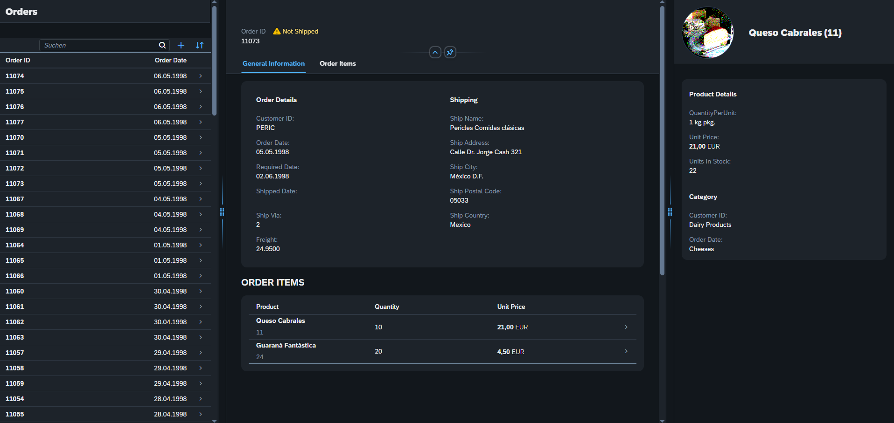

# Escape Room

You are a developer. You check your mails. Nothing fancy, just the usual spam. 

But then.

An incident.

A broken Fiori app. Not again...

You have never worked on this app before so you head over to GitHub and clone it.

You have cloned the app, installed the dependencies and you have started the app and the browser opens. 

You see.. nothing. 

But why? The app was developed by Marc so it should work, right?

I mean there is so much code already there, surely there must be something...

But you are lucky. The backend seems fine. So it's probably just some frontend errors. How hard can it be to fix this?

You take your magnifying glasses and take a close look. At first you see nothing. But then you look even closer. 

You see.. pixels. But why are they all the same color? Where are the tables? The buttons? The labels?

## The task

So yes... there is code. And yes... it used to work. But some evil forces played with the code. Some instructions are missing. Some are confusing you. Some are just plain wrong.

You know that the app should look like this.

Try to get as close as possible to the final result.

## Hints

- You can ignore all i18n related errors. Just like in a real productive app, amirite?
- The browser dev tools are your friend.
- Googling error messages that appear in the browser dev tools is totally valid
- Sometimes the fix is as easy as adding, removing or changing a single character
- None of the fixes require you to write much code
- None of the fixes require you to create a new file
- None of the fixes require you to write a formatter (well... except one)
- All files in the `webapp` directory should require at least one fix (and maybe there is more to a file than just the code inside) so 
- Your life line ist just one teams message way

## Bonus round

So the code was written in simpler times. Internet Explorer was the GOAT and JavaScript was crap. But a lot has changed since then. Internet Explorer is still the GOAT. And JavaScript has gotten better. Activate the eslint rules (`.eslint.config.mjs`) and fix all errors to have CLEAN code.